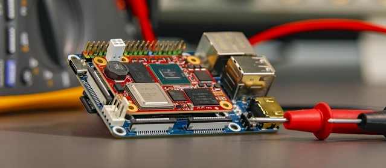

# Embedded Linux for ASTRIAL SoM 
Quickly get your ASTRIAL started with the full-featured and energy-efficient i.MX family and Hailo-8 neural network processor. Our goal is to provide you with a comprehensive Linux environment that is easy to develop your designs with thus reducing your time to market.

## Hardware Documentation
link .pdf **TBD**  

## Software Releases
### Yocto/Kirkstone (LTS until APR 2026)
> #### Prebuilt Images
> download link **TBD**  
> See the detail howto on Hackster.io bringup: [Bringup Guidelines](https://www.hackster.io/andrea-torlai/astrial-bringup-guidelines-6f8423)  
> Use our prebuilt images for a quick jumpstart of your system.  
> DISCLAMER: prebuilt images are provided for testing purpose only, not intended for final production.
> #### Yocto Build Guidelines
> If you want to build an customize your yocto/linux build see the details on page: [astrial meta layer](https://github.com/System-Electronics/meta-sysele-nxp-5.15.71).
> #### Astrial Official Demo
> gesture control for robotic arm  
> mettere il link a lvideo su youtube qua! **TBD**  
> If you want to learn how to replicate our official demo see instructions here: [astrial dobot demo](https://github.com/System-Electronics/astrial_dobot_demo_ew2024).
> #### Astrial Tutorials
> If you want to learn how to run our tutorials, please see instruction at the link: [astrial tutorials](https://github.com/System-Electronics/astrial_tutorials)
