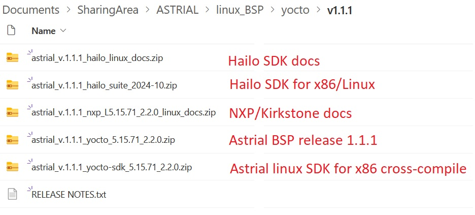

  

----

# Embedded Linux for ASTRIAL SoM 
Quickly get your ASTRIAL started with the full-featured and energy-efficient i.MX family and Hailo-8 neural network processor. Our goal is to provide you with a comprehensive Linux environment that is easy to develop your designs with thus reducing your time to market.

# Astrial channels
Follow us on the main website [www.astrial.ai](http://www.astrial.ai) and on social media for the latest news on ai@edge :

  

## Documentation
Astrial is made of two main components: NXP i.mx8-m-plus CPU and the Hailo-8 co-processor. For this reason the documentation is given as a collections of documents.

From the official Astrial website you can retrieve the hardware schematics and the opering guide: [astrial documents](https://www.systemelectronics.ai/en/documents)

For your convenience you can also find the extra documents for NXP and Hailo into the download section of Astrial website (togheter with the prebuilt yocto release).
Since for each release the NXP and Hailo toolchain might have changed version you will always find these files in the same folder of the download section [astrial downloads](https://coesia.sharepoint.com/:f:/s/systemelectronics_ai_ftp/EoEh2naiznZFreJtwZs2nucBY0I14Uj7lH1TAlr6h7WKFg?e=7ybMh5)

Here is an example of the file structure for release v.1.1.0:

If you want to customize and compile your own neural networks you will need the Hailo documentation for Data Flow Compiler DFC. Installing the SDK on your linux/x86 machine (docker, see Hailo documentations) you will be able to parse, optimize and train your ONNX and TFlite files. Once compiled you will get the binary ".hef" file to be used on Astrial with the HailoRT (run time library)  

If you are working with video streams do not forget to read the specific GStreamer User Guide that will allow you to leverage hw acceleration for video encode/decode/mux, see the link here: [NXP Gstreamer USer Guide](https://community.nxp.com/pwmxy87654/attachments/pwmxy87654/imx-processors%40tkb/15/2/i.MX8GStreamerUserGuide.pdf)

## Tutorials
On Hackster.io you will find step-by-step tutorials for simple task on Astrial. Each tutorial has a video explanation too. See the Hackster.io main page here: [https://www.hackster.io/andrea-torlai](https://www.hackster.io/andrea-torlai)

  

## Communities
Being a platform based on both NXP i.mx8m-plus and Hailo H8, Astrial users can leverage both communities for questions outside of the documentation and available examples.
For NXP imx8 you can refer to [NXP imx8 community](https://community.nxp.com//?profile.language=en). For Hailo you can refert to [Hailo-8 community](https://community.hailo.ai/tag/hailo8)

## Software Releases
Below is a list of all the linux BSP (board support package) releases available for ASTRIAL. Each release has a dedicated github repo, prebuilt images (for testing purposes) and some custom demos and tutorials.
### Yocto/Kirkstone (LTS until APR 2026)

Prebuilt Images 

Use our prebuilt images for a quick jumpstart of your system, you can download the files from the SystemElectronics sharepoint.

Click [SysEle-Sharepoint](https://coesia.sharepoint.com/:f:/s/systemelectronics_ai_ftp/EoEh2naiznZFreJtwZs2nucBY0I14Uj7lH1TAlr6h7WKFg?e=7ybMh5) to 
access the sharepoint and download the release you are looking for.
  
To properly bringup your board and install the prebuiltimage see the detail howto on Hackster.io bringup:
  
[Bringup Guidelines](https://www.hackster.io/andrea-torlai/astrial-bringup-guidelines-6f8423)  

 IMPORTANT: if your board has been installed already you will have to erase the emmc before flashing the new one.
 See the detail of the [astrial-yocto-install](https://github.com/System-Electronics/meta-sysele-nxp-5.15.71/blob/main/ASTRIAL-YOCTO-INSTALL.md) here: [Board Programming](https://github.com/System-Electronics/meta-sysele-nxp-5.15.71/blob/main/ASTRIAL-YOCTO-INSTALL.md#board-programming)

_DISCLAMER: prebuilt images are provided for testing purpose only, not intended for final production_.

Yocto Build Guidelines

If you want to build an customize your yocto/linux build see the details on page: 

[astrial meta layer](https://github.com/System-Electronics/meta-sysele-nxp-5.15.71).

Official Demo

The Astrial official demo for Embedded World 2024 is a gesture control for a robotic arm.
here is the video on youtube:

[https://www.youtube.com/watch?v=RwSaMLdL3Fw](https://www.youtube.com/watch?v=RwSaMLdL3Fw)

If you want to learn how to replicate our official demo see instructions here: [astrial dobot demo](https://github.com/System-Electronics/astrial_dobot_demo_ew2024).

Astrial Tutorials

If you want to learn how to run our tutorials, please see instructions at the link: 

[astrial tutorials](https://github.com/System-Electronics/astrial_tutorials)

